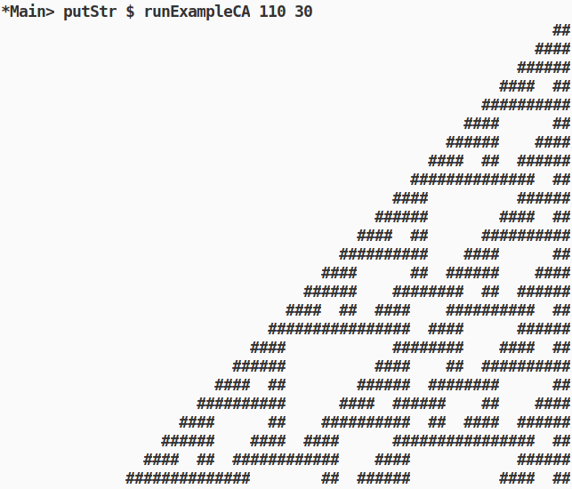

# Седмица 2 - Pattern matching, where, let in, case of



- [Elementary cellular automaton](https://en.wikipedia.org/wiki/Elementary_cellular_automaton)
- [Rule 110](https://en.wikipedia.org/wiki/Rule_110)

## Материал

### Throwback

- Листи
  - Добавяне - отпред, отзад, Конкатенация, Индексиране
  - List ranges
  - List comprehensions

### Неща за които не остана време

- Деструкториране на лист - `head`, `tail`, `last`, `init`

- Кортежи (tuples)
  - Като лист, ама с определена дължина, която предварително знаем.
  - Може да съдържа стойности на данни от различни типове.
  - Типът на кортежа се определя от типовете на данните в него (в реда в който се срещат).
  - Пример - вектор
  - Пример - асоциативен списък - име/факултетен номер.
  - `fst`, `snd`
    - Как можем да си ги имплементираме?

### Pattern matching с листи и кортежи

Идея - пишем различни имплементации в зависимост от "формата" на входа.

- Мачване на прости форми
- Мачване на листи - празен лист `[]` vs `(глава : опашка)`
- Мачване на кортежи
  - Имплеметиране на `fst`, `snd`
  - Вектор, наредена 2ка - `addVec`

#### Гардове, къде?

```hs
-- Фибоначи с where
fib n =
  iter 0 1 n
  where
    iter a _ 0 = a
    iter a b cnt = iter b (a + b) (cnt - 1)

-- Фибоначи с гард
fibGuard n
  | n == 0 = 0
  | n == 1 = 1
  | otherwise = fibGuard (n - 1) + fibGuard (n - 2)
```

### Let in, case of

`Let <дефинираме порменливи> in <резултатен израз, който вижда променливите>`,
като `where`, ама локално.

Пример - нормализиране на вектор:

```hs
vecLen :: Floating a => (a, a) -> a
vecLen (x, y) = sqrt (x * x + y * y)

normalized :: Floating b => (b, b) -> (b, b)
normalized v@(x, y) = let l = vecLen v in (x / l, y / l)
```

## Задачи

1. Write a program that prints the numbers from 1 to 100. But for multiples of three print “Foo” instead of the number and for the multiples of five print “Bar”. For numbers which are multiples of both three and five print "FooBar".
2. Напишете ф-я което транспонира матрица.

   ```hs
   transpose [[1,2,3], [4,5,6]] == [[1,4], [2,5], [3,6]]
   ```

3. Напишете ф-я за обединение на 2 списъка. Реултата е списък който съдържа елементите на едният и другият списък без повторение.
4. Напишете ф-я която прави сеченеи на елементите на 2 списъка.
5. Да се дефинира функция за превръщане на цяло число в стринг.
6. Да се дефинира функция която парсва число от стринг (от `"123"` в `123`).
