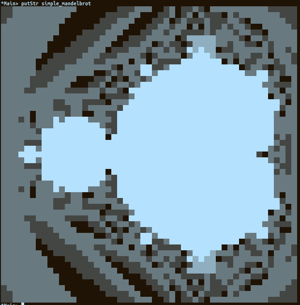

# Бонус задачка - Mandelbrot

Напишете израз `simple_mandelbrot`, стойността на който да е фракталът на Манделброт изрисуван с `Char`-овер.
Стойността на израза трябва да е `String` (`[Char]`), и когато го покажем на конзолата с `putStr simple_mandelbrot` трябва да се визуализира по начин подобен на този в картинката
(не е задължително да е точно както в примера).

Може да използвате всякакъв лист от ASCII символи за визуализация, но е добре да са подбрани така, че фрактала да се вижда отчетливо.
Препоръчвам да използвате следния набор от символи - ` ░▒▓█`.

Изразът трябва да се смята динамично, а не да е просто hardcode-нат.

### Ресурси

- [Mandelbrot-set Wikipedia](https://en.wikipedia.org/wiki/Mandelbrot_set)
- [The Mandelbrot Set - Numberphile](https://www.youtube.com/watch?v=NGMRB4O922I)
- [Box-drawing Character Wikipedia](https://en.wikipedia.org/wiki/Box-drawing_character)
