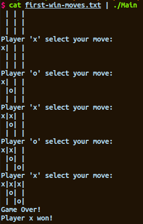

# Седмица 5 - Модули. Зареждане на модули. Вградени модули (Data - Map, List, Set). Писане на модули



[Recreational Mini-Project of the week](./TicTacToe)

## Материал

### Какво правихме предния път

- Lambda functions - функции без имена които няма да преизползваме
- Алгебрични типове - Множества от стойности получени чрез обединение и сечение.
  - Синтаксис `data Type' = Value1 String String | Value2 Float`
  - Четем тип `Type'` може да има стойност `Value1` или `Value2`
  - `Value1` и `Value2` може да обединяват поредица от стойности.
- Можем да имаме рекурсивно дефинирани типове - Пример: `[]`
- Typeclasses - "интерфейси".
  - `Eq`, `Ord`, `Num`, etc.

### Не остана време за

### Двоично дърво

```hs
data Tree a = Empty | Tree a (Tree a) (Tree a) deriving (Show)
```

#### Record syntax

```hs
data Student' = Student'
  { firstName :: String,
    lastName :: String,
    facultyNumber :: Int,
    bio :: String
  }
  deriving (Show)
```

## Модули

> A Haskell module is a collection of related functions, types and typeclasses.

Синтаксис `import <module name>`

**Пример:**

```hs
import Data.List

numUniques :: (Eq a) => [a] -> Int
numUniques = length . nub
```

**Импортиране в GHCi**

```hs
ghci> :m + Data.List

ghci> :m + Data.List Data.Map Data.Set -- import multiple modules in GHCi
```

**Селективно импортиране (импортирай само каквото ти трябва)**

```hs
import Data.List (nub, sort)
```

**Hiding**

```hs
import Data.List hiding (nub) -- Import everything but `nub`
```

**Не пръскай всичко в главния скоуп** (също е начин да се справим с импортиране на ф-ии с имена които вече сме дефинирали)

```hs
import qualified Data.Map

Data.Map.filter -- refers to the filter in `Data.Map`
```

но може идентификаторите с които реферираме ф-ии да станат прекалено дълги.

**Именоване на импортиран модул**

```hs
import qualified Data.Map as M

M.filter -- much better 😌
```

**[Haskell Hierarchical Libraries](https://downloads.haskell.org/~ghc/latest/docs/html/libraries/)** - Документация на стандартната библиотека (какви модули има и кое къде е).

## Задачи

<!-- TODO -->
