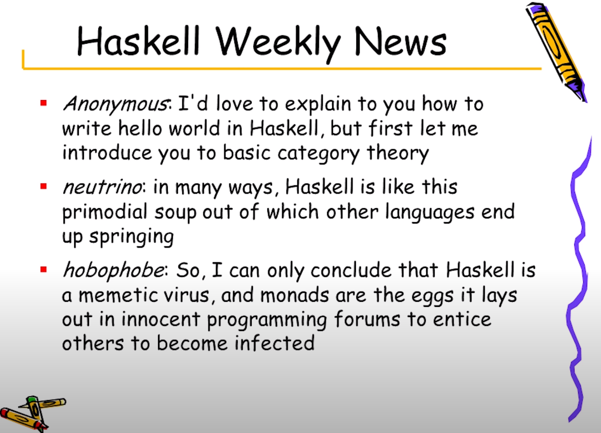

# I/O операции в Хаскел



[YouTube - Simon Peyton-Jones: Escape from the ivory tower: the Haskell journey](https://youtu.be/re96UgMk6GQ?t=1277)

## Материал

- Сложете си [haskell-linter](https://marketplace.visualstudio.com/items?itemName=hoovercj.haskell-linter) ако пишете на VSCode

### Какво правихме предния път

- модули - начин да си структорираме кода във файлове
- импортиране на модули
  - `import Data.List`
  - `import Data.List (nub, sort)`
  - `import Data.List hiding (nub)`
  - `import qualified Data.Map`
  - `import qualified Data.Map as M`
- имплементирахме Tic-Tac-Toe, но имаше _лек_ проблем в имплементацията
  - не е добре да имаме различни record конструктори с различни _пропъртита_

### Something cool out of context

Демонстрира lazyness и мемоизация

```hs
> x = 1 + 2 :: Int
> :sprint x
x = _
> x
3
> :sprint x
x = 3
```

> :sprint ти показва стойност, без да я _форсира_
>
> - [Georgi Lubenov @googleson78#6163](https://github.com/googleson78)

### IO

_30мин за IO като нещо което променя света_

Голяма част от примерите са любезно откраднати от - [Learn You a Haskell for Great Good - Input and Output](http://learnyouahaskell.com/input-and-output)

- Хакел е готин защото всичко е чисто, но как да въздействаме на света
  без да имаме възмоност да променяме състояние.

  > it has to change the state of an output device (usually the state of the screen), which then emits photons that travel to our brain and change the state of our mind, man

- `IO` е тип с който отделяме конуникацията със света от чистата природа на ф-иите в Хаскел.

- Време е за `hello world`

  ```hs
  main = putStrLn "Hello World"
  ```

  > We can read the type of `putStrLn` like this: `putStrLn` takes a string and returns an `I/O` action

- IO действие е тип "кутийка", обикновено върши нещо `мръсно` (не чисто) и връща някакъв резултат в себе си (защото е "кутийка")

- синтактична конструкция `do` - позволява ни да лепим последователност от `IO` действия (и не само, но за това по-нататък)

  Пример:

  ```hs
  main = do
      putStrLn "Hello, what's your name?"
      name <- getLine
      putStrLn ("Hey " ++ name ++ ", you rock!")
  ```

- Залепили сме няколко `IO`-та в едно.
- getLinst връща `IO` кутийка с резултат - `<-` ни позволява да отоврим кутийката и да вземем каквото има в нея (bind-ваме резултата)
- можем да "бъркаме" в `IO` кутийка само когато сме в `IO` връщаща ф-я (за да не цапаме чистите си ф-ии с не чистото `IO`)

- Това ще работи ли?

  ```hs
  nameTag = "Hello, my name is " ++ getLine
  ```

  Защо?

- Mожем да байндваме и към `putStrLn`, но няма много смисъл

- `=` /= `<-`

- Можем да `let`-ваме в `do` (дори без `in` частта) - разгледай `mainCalculator`

- `runhaskell` on the fly

- `return` - не е каквото си мислите

  - не прекъсва изпълнението
  - какво прави тогава? - опакова стойност в `IO`

- Пример за чейннат `main` без `do`

### IO Функции

- `putStr`

- `putChar`

  как имплементираме `putStr`, рекурсивно

  ```hs
  putStr :: String -> IO ()
  putStr [] = return ()
  putStr (x:xs) = do
      putChar x
      putStr xs
  ```

- `print = putStrLn . show`

- `when` в `import Control.Monad`

  ```hs
  import Control.Monad

  main = do
      c <- getChar
      when (c /= ' ') $ do
          putChar c
          main
  ```

- `sequence :: [IO a] -> IO [a]` - взима няколко действия, изпълнява ги и ни връща резултатите им.

  ```hs
  main = do
      a <- getLine
      b <- putStr "test"
      print [a,b]

  -- ==

  main = do
    seq = sequence [getLine, putStr "test"]
    print seq
  ```

- `mapM` and `mapM_` - sequence-ва колекция от монади до монада от колекция

  ```hs
  mapM print [1,2,3]
  -- vs
  mapM_ print [1,2,3]
  ```

- `forever` - чейнва IO action със себе си forever

- `forM = flip mapM` - дава ни готин синтаксис

- `getContents` - чете от stdin докато не срещне `end-of-file`

- `interact :: (String -> String) -> IO ()` - чете вход, дава хо на обработващата чиста ф-я и принт-ва резултата.

#### Рабта с файлове

- `readFile :: FilePath -> IO String` - чете

- `writeFile :: FilePath -> String -> IO ()` - пише

По-детайлно може да разгледате [тук](http://learnyouahaskell.com/input-and-output#files-and-streams)

## Задачи

1. TODO: (T_T)
